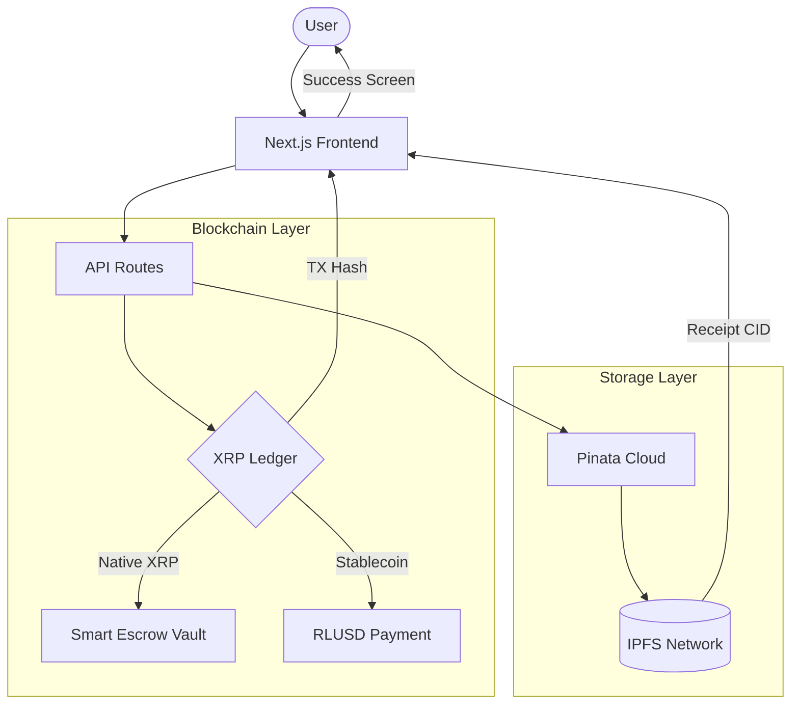

# SubLedger

SubLedger is a decentralized subscription and recurring payment layer built on the XRP Ledger. It enables users to secure long-term financial commitments through on-chain Smart Escrows or direct stablecoin (RLUSD) transfers, with every transaction backed by an immutable cryptographic receipt pinned to IPFS.

## Hackathon Track Alignment

### XRPL Real-World Impact
SubLedger addresses the "Subscription Rails" direction by providing a production-ready interface for recurring payments.
- Features native XRP Smart Escrows to time-lock funds on-chain.
- Supports Ripple's official stablecoin (RLUSD) on the XRPL Testnet.
- Implements automated Trustline management for seamless stablecoin onboarding.

### Open Innovation (General DApp)
The project fulfills the requirement for meaningful on-chain state changes.
- Executes `EscrowCreate` transactions to lock liquidity in smart vaults.
- Performs `Payment` transactions with custom Memo data for metadata tracking.
- Interacts with the XRPL Testnet in real-time to verify account balances and transaction status.

### Best Beginner Track
As a first-time attendee of the Midwest Blockathon and my first ever Web3 hackathon, SubLedger represents a rapid deep-dive into decentralized technologies, moving from zero to a fully functional multi-chain architecture (XRPL + IPFS) in a single weekend.

### Pinata Builder Track
Pinata is an integral part of the SubLedger architecture, used to solve the problem of "Transaction Proof Transparency."
- Every subscription generates a structured JSON receipt.
- This receipt is pinned to IPFS via Pinata immediately after the on-chain state change.
- The resulting IPFS CID is provided to the user as a decentralized, permanent proof-of-payment that exists independently of the application database.

### Best Hack Built with Google Antigravity
SubLedger was developed entirely using the Google Antigravity agentic development platform.
- Used Antigravity's context-aware chat to architect the XRPL transaction flows.
- Leveraged Antigravity's code modification tools to refactor the UI and handle complex hex-encoding for XRPL Memos.
- Utilized the integrated terminal and browser tools to debug Testnet connectivity and trustline errors in real-time.

## Technical Core
- Blockchain: XRP Ledger (Testnet)
- Storage: IPFS (via Pinata)
- Assets: XRP (Native) and RLUSD (Stablecoin)
- Framework: Next.js 14 with TypeScript
- Tools: Google Antigravity IDE

## Getting Started
1. Generate an address on the Wallet page.
2. Fund the address using the integrated Testnet Faucet.
3. Configure a subscription on the Create page using either the Smart Escrow or RLUSD mode.
4. Confirm the transaction and view your immutable receipt CID.
